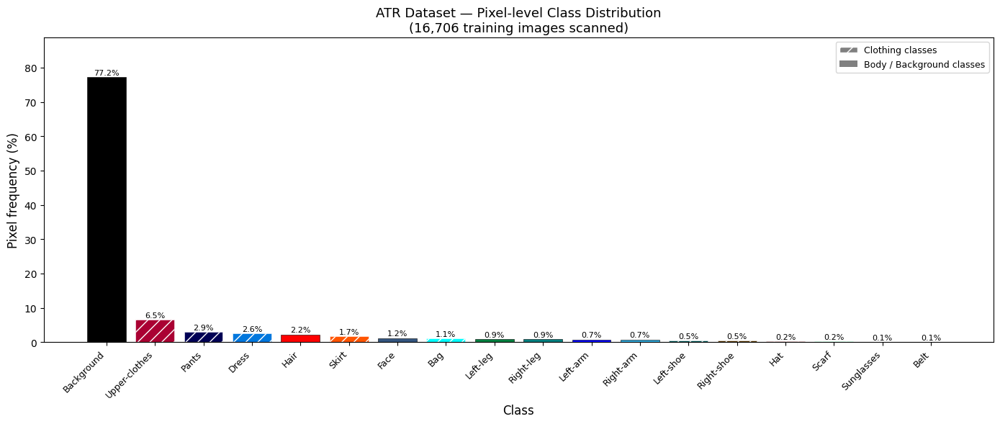
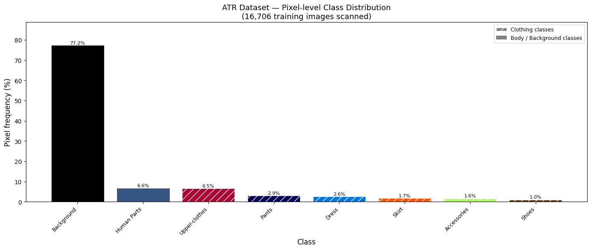
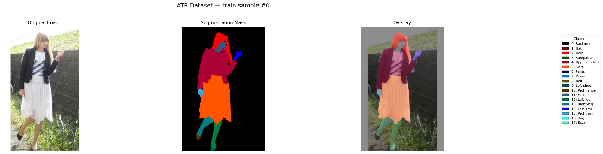
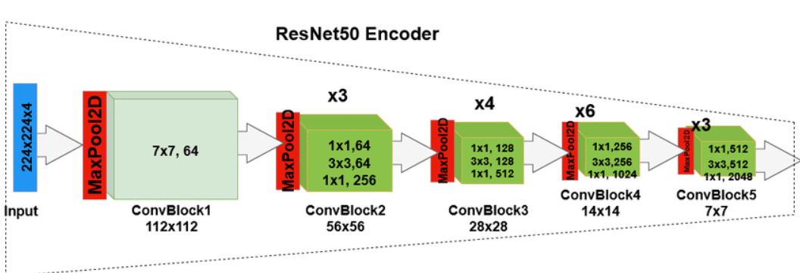
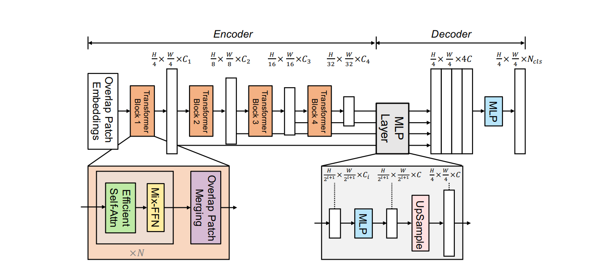
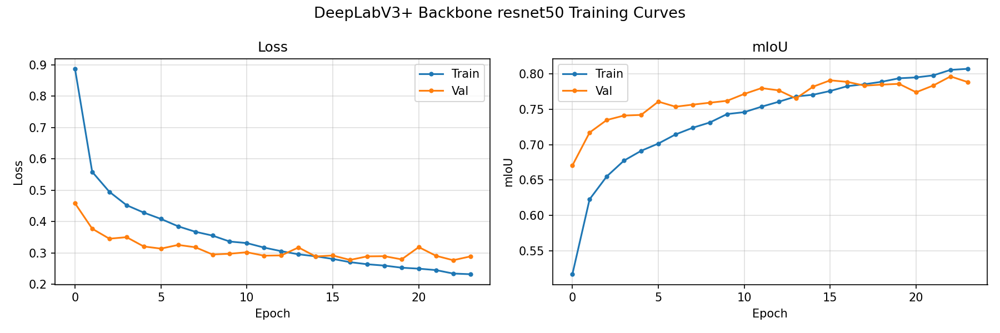
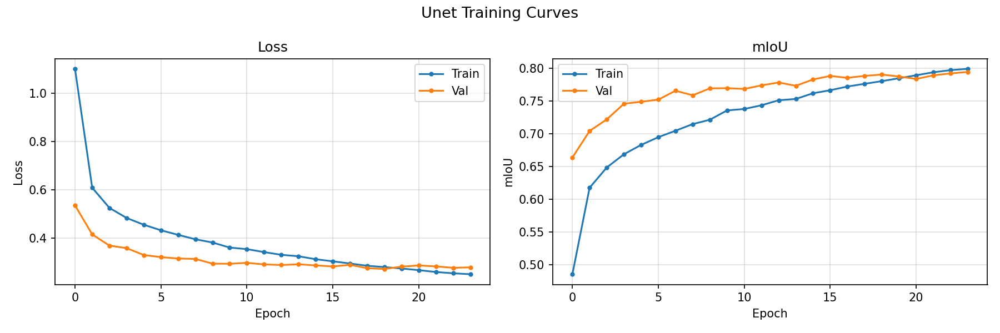

# ATR Clothing Semantic Segmentation Report

| Dataset| Models | Classes | Input Size
|---|---|---|---|
| ATR (17,906 images)| U-Net · DeepLabV3+ · SegFormer-B0 |8 merged classes|512 × 384 px

The system takes as input an RGB image of a person and produces a pixel-level segmentation mask over eight clothing and body-part categories. Three model families are compared: a CNN encoder-decoder (U-Net + ResNet-50), a CNN with dilated multi-scale context (DeepLabV3+ + ResNet-50), and a Transformer-based architecture (SegFormer-B0).

---
##  Dataset Choice and Reason

###  The ATR Dataset

The dataset used throughout the project is the **ATR (Active Template Regression) dataset**, a standard benchmark for human parsing. It consists of fashion/portrait images, each accompanied by a pixel-level segmentation mask where every pixel carries one of the original 18 class labels. Images are loaded via a HuggingFace mirror, making integration into Kaggle/Colab environments straightforward without manual download steps.

| Split | Number of images |
|---|---:|
| Train | 16,706 |
| Validation | 1,000 |
| Test | 200 |
| **Total** | **17,906** |

### Reasons for Choosing ATR

- **Dense pixel-level annotations**: Every pixel in every image carries a clothing or body-part label, making the dataset directly usable for semantic segmentation without additional annotation work.
- **Clothing and body-parsing focus** : The label taxonomy closely matches the project goal of identifying garment regions at pixel level.
- **Single centered subject per image** : Simplifies the learning task compared to multi-person scenes and keeps the evaluation clean.

### Original labels and merged labels

The original ATR annotation scheme contains **18 fine-grained classes**. Several of these are either very small in pixel coverage or symmetric(left-shoe / right-shoe). Keeping all 18 classes would create severe class imbalance and make the segmentation task unnecessarily hard for small-object classes. The labels are therefore merged into **8 final classes**

| Final ID | Final class | Original labels included |
|---:|---|---|
| 0 | Background | Background |
| 1 | Upper-clothes | Upper-clothes |
| 2 | Skirt | Skirt |
| 3 | Pants | Pants |
| 4 | Dress | Dress |
| 5 | Shoes | Left-shoe + Right-shoe |
| 6 | Human Parts | Hair, face, arms, legs |
| 7 | Accessories | Hat, sunglasses, belt, bag, scarf |
> Note: Merging symmetric labels (left/right shoe, left/right arm) is justified by the horizontal-flip augmentation applied during training.

### Raw Pixel Class Distribution

The dataset is heavily class-imbalanced. Background accounts for approximately 77% of all pixels across the 16,706 training images. After merging, the rough per-class pixel frequencies are
| Distribution before Label Merging| Distribution after Label Merging |
|---|---:|
|  | |

**Original ATR Image**




**Merged Sample**

>
---

## Preprocessing pipeline

- The ATR dataset had some mask quality problems that could negatively affect model training. One main issue was the presence of **holes** in the segmentation masks. These holes are background-labeled pixels, with value `0`, that appear inside or around other labeled regions. They can be found at object edges and sometimes even inside clothing or body-part masks. 

- Another problem was that some labels extended outside the real object boundaries. In some images, mask regions slightly spilled into the background or overlapped with nearby labels. This means that the ground-truth mask was not always perfectly aligned with the actual object in the image.


**Annotation “holes” & Labels “spilling”**
![Annotation “holes” & Labels “spilling” ]


The following preprocessing steps were applied on the the segmentation mask:

1. **Remove small noisy components**
   Very small disconnected mask parts were removed using connected component analysis. The minimum area was set to `150` pixels. Any connected region smaller than this threshold was considered noise and removed.
2. **Fill enclosed holes**
   Some clothing and body part regions contained empty holes inside them. These holes were filled separately for each class. 
3. **Close small gaps**
   Morphological closing was applied using an elliptical kernel of size `7`. This operation helped connect small breaks and gaps inside segmented regions. It also improved the continuity of masks, especially around clothing and body part boundaries.

**Before and after preprocessing**

>
>Note: Shoes and accessories are skipped during some cleaning steps because they naturally occupy small areas.

---

## Augmentation pipeline

Because the ATR dataset contains mostly clean, centered single-person images, augmentation is critical to preventing the model from memorizing the dataset distribution. All spatial transformations are applied identically to both the image and the mask; masks are always resized with nearest-neighbour interpolation to avoid introducing spurious class IDs.

### Standard augmentations

The standard augmentations used in the notebooks are:

| Augmentation | Purpose |
|---|---|
| Resize to 512 × 384 | Fixed model input size; maintains portrait aspect ratio |
| Horizontal flip | Useful because left/right clothing labels were merged |
| Affine transform | Simulates varying camera distance and slight tilt|
| ColorJitter | Lighting variation robustness|
| Gaussian noise | Simulates sensor noise |
| Gaussian blur | Robustness to slight defocus|
| ImageNet normalization | Matches pretrained encoder statistics |

### Custom augmentations

#### Background weather augmentation

Weather effects (rain, fog, snow and  sun flare each sampled with probability 0.5 per training sample) are applied exclusively to background pixels identified by the mask. This simulates changing outdoor lighting and weather conditions without corrupting the clothing labels, which is the training target.

#### Cloth erase

A random rectangle is placed over a clothing region. The mask for that rectangle is simultaneously set to Background (class 0). This simulates occlusion and forces the model to reason about partial clothing visibility rather than always seeing complete garment regions.
#### Texture overlay

Synthetic stripe or dot textures are blended into clothing pixels (alpha = 0.30, p = 0.25). This prevents the model from relying on specific texture patterns from the training set, improving generalization to unseen garment designs.


## Model Architecture

Three segmentation models are trained and compared. All models share the same input resolution (512 × 384 ) px, output 8 logit channels (one per class), and produce their final segmentation mask via argmax over the channel dimension. The models span two paradigms: **CNN-based** (U-Net and DeepLabV3+) and **Transformer-based** (SegFormer-B0).

### U-Net + ResNet-50
**Core Innovation: Skip Connections**

U-Net introduces a symmetric encoder-decoder architecture where every encoder stage is connected directly to its corresponding decoder stage using a **skip connection**. 
This design solves the classic information bottleneck of simple encoder decoder pipelines, which is that the encoder compresses the image into a compact feature vector, losing fine-grained spatial detail, while the decoder must reconstruct a full-resolution segmentation. 
Skip connections feed high-resolution spatial features from the encoder directly into the decoder, allowing the network to simultaneously reason about high-level semantics (from the bottleneck) and low-level spatial details (from the skips).

#### ResNet-50 Backbone
The standard U-Net encoder is replaced with a **ResNet50** backbone pre-trained on ImageNet. ResNet50's **residual connections** enable very deep feature extraction without the vanishing gradient degradation issue. ImageNet pretraining gives the encoder a strong prior on low level texture and edge features before any clothing segmentation task training begins, accelerating convergence and improving performance on small training subsets.

| Unet Architecture | ResNet-50 Backbone |
|---|---:|
|  | |

---

### DeepLabV3+ + ResNet-50 Encoder
**Core Innovation: Atrous Convolutions and Multi-Scale Context (ASPP)**

Standard convolutions operate at a fixed receptive field,the model either captures fine detail or wide context, not both simultaneously. **Atrous (dilated) convolutions** solve this by inserting gaps into the convolution kernel, expanding the effective receptive field without increasing the number of parameters or reducing the feature map resolution.

DeepLabV3+ applies multiple atrous convolutions in parallel , each with a different dilation rate. This means the model simultaneously analyzes the image at multiple scales in a single forward pass. 
The decoder in DeepLabV3+ then fuses this multi-scale context with low-level spatial features from the encoder, recovering sharp boundaries. 


#### DeepLabV3+ Architecture

>  


The ASPP module is the key differentiator from U-Net. It can detect clothing regions at multiple scales simultaneously ,understanding both fine garment texture and the global body outline in a single pass.

---

## SegFormer-B0(Transformer-Based)
**Core Innovation: Hierarchical Transformer Encoder with a Lightweight MLP Decoder**

SegFormer replaces all convolutional layers in the encoder with **self-attention**. Self-attention computes relationships between all pairs of spatial positions in the feature map, giving the model a global receptive field from the very first layer.
The encoder is the  **Mix Transformer (MiT-B0)**, which produces feature maps at four different resolutions .Each stage uses **Efficient Self-Attention** to keep computation tractable at high resolutions, and a **Mix-FFN** that implicitly encodes positional information through **depthwise convolution** thus eliminating the need for fixed positional embeddings and making the model more robust to input resolution changes.

The MLP decoder is intentionally simple, it concatenates multi scale features from all four encoder stages and fuses them with linear layers .That because the Transformer encoder already captures rich global context, the decoder does not need to be complex.

### SegFormer Architecture

>


## Loss Function Selection

Training a segmentation model on clothing data means dealing with a heavily skewed dataset. Background pixels dominate every image, while small classes like accessories or shoes appear in only a fraction of pixels. A simple Cross-Entropy loss would let the model achieve low loss simply by predicting background everywhere so we need a **Combined loss** 

```python
total_loss = CrossEntropyLoss(weight=class_weights) + 0.5 * DiceLoss
```

### Weighted Cross Entropy Loss — Getting Each Pixel Right

Cross Entropy Loss is a standard loss multi-class semantic segmentation. It treats segmentation as a per pixel classification problem. Each pixel has one correct class, and the model is penalized if it assigns low probability to that class.

The loss is weighted using class weights because the dataset is imbalanced "Background is very common, while classes like dress and accessories appear much less" and to overcome class imbalance, each class is assigned an inverse-square-root frequency weight and these weights are passed to the cross entropy loss

```python
class_weights = 1.0 / sqrt(class_frequency + 1e-6)
class_weights = class_weights / class_weights.sum()  
nn.CrossEntropyLoss(weight=class_weights)
```

### Dice Loss — Getting the Shape Right

Dice Loss measures overlap between the predicted region and the true region.

```python
L_Dice = 1 - (2 * sum(p_i * g_i)) / (sum(p_i) + sum(g_i) + epsilon)
```
Cross Entropy focuses on getting each pixel's class assignment correct, but does not explicitly care about the spatial compactness of predicted regions. Dice Loss directly optimizes the F1 score of each class region, which is particularly beneficial for small classes so that even a single correctly predicted pixel in a rare class region contributes with a meaningful gradient signal when Dice Loss is used alongside Cross Entropy.

### Combine them


| Loss | What it helps with | Weight|
|---|---|---|
| Weighted Cross-Entropy | Correct class prediction for each pixel |1
| Dice Loss | Good overlap between predicted and true regions |0.5
>The 0.5 Dice weight is chosen so that Dice contributes meaningfully to the gradient signal without dominating the Cross-Entropy term. 
---
## Optimizer and Learning Rate Schedule

The model notebooks use these common settings:

| Setting | Value | |
|---|---|---|
| Learning rate | 6e-5 |
| Optimizer | AdamW |
| Weight decay | 1e-4 |Regularization to prevent overfitting on the training set|
| Scheduler | Polynomial decay, power = 0.9 |Smooth LR decay|
| Early stopping | Patience = 7 |Stops training when val mIoU plateaus|

The polynomial learning rate schedule is:

```text
lr(t) = lr0 * (1 - t / T)^0.9
```

---


## Evaluation Metrics and Performance Analysis

Each model is evaluated using a confusion matrix computed over the full test set. From the confusion matrix, the following metrics are derived

| Metric | Meaning |
|---|---|
| Pixel Accuracy | Percentage of all pixels classified correctly |
| Mean Class Accuracy | Average accuracy per class |
| Mean IoU | Average Intersection over Union across classes "penalizes both FPs and FNs" |
| Precision | Of the pixels predicted as a class, how many are correct |
| Recall | Of the true pixels of a class, how many were found |
| F1-score | Balance between precision and recall |

### mIoU Metric

Mean IoU is the most important metric because pixel accuracy can be misleading. it treats all 8 classes equally and penalises both false positives and false negatives, providing a realistic view of segmentation quality across the full label spectrum.

$$\text{mIoU} = \frac{1}{C} \sum_{c=1}^{C} \frac{TP_c}{TP_c + FP_c + FN_c}$$


### Overall Test Results

| Model | Pixel Accuracy | Mean Class Accuracy | Test mIoU | 
|---|---:|---:|---:|
| DeepLabV3+ ResNet-50 | 96.48% | 81.68% | 69.76% | 
| U-Net ResNet-50 | 95.09% | 80.55%| 66.77%| 
| SegFormer-B0 | 96.64%  | 89.26%| 70.99% | 


### DeepLabV3+ Detailed results



| Class | IoU | Precision | Recall | F1 |
|---|---:|---:|---:|---:|
| Background | 97.53% | 99.94% | 97.59% | 98.75% |
| Upper-clothes | 89.39% | 93.26% | 95.56% | 94.40% |
| Skirt | 56.98% | 69.52% | 75.95% | 72.59% |
| Pants | 87.08% | 93.25% | 92.94% | 93.09% |
| Dress | 15.02% | 18.86% | 42.45% | 26.11% |
| Shoes | 81.76% | 83.09% | 98.08% | 89.97% |
| Human Parts | 93.49% | 94.70% | 98.66% | 96.64% |
| Accessories | 36.80% | 55.44% | 52.25% | 53.80% |

**Strengths**
- **Human Parts, Upper-clothes, Pants, Shoes** all exceed 80% IoU,the model handles large, visually distinct regions well.
- Shoes achieves 98% recall despite being the **smallest class by pixel count**.

**Weaknesses**

- **Dress (15.02%)** confused with Upper-clothes and Skirt; the model splits a dress into two garment predictions instead of recognizing it as one.
- **Skirt (56.98%)** contaminated by Dress misclassifications; when a dress is present the model often labels the lower half as Skirt.
- **Accessories (IoU 36.80%))**:Maybe combining visual signatures (hats, bags, sunglasses, scarves, belts) with no common shape make it hard for the model to segment. 


### Unet Detailed results


| Class | IoU | Precision | Recall | F1 |
|---|---:|---:|---:|---:|
| Background |97.77%  |   99.84% |  97.92% |  98.87%
| Upper-clothes |  82.54% |    93.85%|   87.26% |  90.44%
| Skirt | 46.55%  |   56.93% |   71.85% |  63.53%
| Pants |  85.39% |    92.89% |  91.36%  | 92.12%
| Dress |  8.02%  |    8.81%  | 46.99% |  14.84%
| Shoes | 82.71%  |   83.85% |  98.39% |  90.54%
| Human Parts |  94.30%  |   95.62% |  98.55% |  97.07%
| Accessories | 36.88%  |   55.79%  | 52.10% |  53.88%

**Strengths**

- **Human Parts (IoU 94.30%) and Shoes (IoU 82.71%)** : UNet's best classes

**Weaknesses**

**Dress(8.02%)  & Skirt (46.55%):** U-Net struggles more than DeepLabV3+ on both. The Dress IoU drops further to 8.02% (vs 15.02% for DeepLabV3+),Skirt also falls to 46.55% (vs 56.98%), indicating more contamination from mispredicted Dress samples.

**Accessories (IoU 36.88%):** nearly identical to DeepLabV3+ (36.80%).

### SegFormer-B0 detailed results


| Class | IoU | Precision | Recall | F1 |
|---|---:|---:|---:|---:|
| Background |  97.45%   |  99.92%  | 97.52% |  98.71%
| Upper-clothes | 89.89%  |    94.39% | 94.97%  | 94.68%
| Skirt |  63.10% |    70.08% |  86.37% |   77.38%
| Pants |  87.15% |    92.74% |  93.54% |  93.14% |
| Dress | 35.75%  |   35.76% |  99.87% |  52.67%   |
| Shoes | 75.41%  |   78.32% |  95.31% |  85.98%| 
| Human Parts | 93.29%  |   95.44% |  97.65% |  96.53%|
| Accessories | 25.85%  |   35.44% |  48.87%  | 41.08% |

**Strengths**

- **Skirt (IoU 63.10%)** : This is SegFormer's most convincing win. The CNN models struggle here U-Net in particular fails badly at 46.55% ,while SegFormer leads by over 6 points against DeepLabV3+ and over 16 points against U-Net.

- **Upper-clothes and Pants** are SegFormer's most reliable classes.

**Weaknesses**

**Dress(IoU 35.75% )** The most important failure.SegFormer achieves an extraordinary recall of 99.87% , meaning it almost never misses a true Dress pixel, but its precision collapses to just 35.76%. What this tells us is that the model has learned to over predict the Dress class.it correctly finds every dress in the test set but floods surrounding regions with false Dress predictions.

**Accessories (IoU 25.85%):**  It Performs worse than both DeepLabV3+ (36.80%) and U-Net (36.88%) here.

**Shoes (IoU 75.41% )):** falls roughly 7 points behind both CNN models (~82%).
---

## CNN-based segmentation vs Transformer-based segmentation

Despite that SegFormer B0 being the most architecturally advanced model in this comparison, SegFormer B0 delivered only a modest improvement over the CNN baselines  70.99% mIoU versus 69.76% for DeepLabV3+ and 66.77% for U-Net. "Outside of Upperclothes and Skirt comparison"

SegFormer B0 invested significantly more training time and, in return, delivered a marginal 1.23 point mIoU gain while simultaneously failing significantly on Accessories (−11 pts) and Shoes (−7 pts).

**Small and heterogeneous** objects are where CNNs clearly win. SegFormer scores 11 points below both CNN models on Accessories and 7 points below on Shoes. DeepLabV3+'s ASPP module handles small, scattered objects well by analyzing the image at multiple scales simultaneously 

**The mIoU gain does not justify the training time**. SegFormer gains only 1.23 points over DeepLabV3+ while losing on 4 out of 8 classes. That is not a worthwhile trade-off.

**Dress is not a real win**. SegFormer's Dress IoU of 35.75% comes with a precision of only 35.76% — meaning it over-predicts Dress heavily, labeling other regions incorrectly. High recall alone is not enough; the model is unreliable on this class.


---
## Limitations of the System

**Dataset scope**: ATR contains only single-person, upright, fashion-style images. The models will likely fail on multi-person scenes, unusual poses, occlusion, low-light images, or non-fashion clothing (workwear, uniforms, cultural dress).

**Merged labels**: grouping 18 classes into 8 turns out that it loses useful structure shapes like the Accessories limiting the model to segment.
**Classes Diversity**: The dataset combines all the expected (T-shirts ,Blouses, Tops..etc) into a single Upper clothes class lacks the generalization of the clothes and also confuse the models like in the dress +upper clothes +skirts

**Dataset scope:** ATR contains only single person, upright, fashion style images. The models will likely fail on multi person scenes, unusual poses, heavy occlusion, low light conditions, or non fashion clothing such as workwear, uniforms, and cultural dress.

**Merged labels losing fine-grained structure:** Collapsing 18 original classes into 8 sounds to discards useful shape and structural information. The Accessories class is the clearest example merging hats, bags, sunglasses, belts, and scarves into a single label removes all consistent visual structure, leaving the models with no stable pattern to segment against. 

**Class definitions that cause internclass confusion:** The Upper clothes class groups together all upper body garments (T-shirts, blouses, tops, shirts, and more ) into a single coarse category. This lack of granularity limits the model's ability to generalize across garment types and, more critically, creates a blurry boundary with adjacent classes:
- **Dress vs Upper-clothes vs Skirt**: a dress visually overlaps with both an upper garment and a skirt. All three models struggle to distinguish dress from the other two, with Dress being the worst performing garment class across all models.


